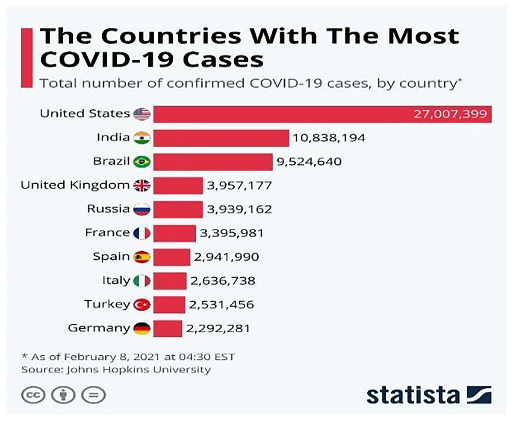

Here is an enhanced and professional-looking `README.md` file for your **COVID-19 Analysis** project, styled consistently with the one for your Food Waste project:

---


# 🦠 COVID-19: Impact on Global Vaccination & Mortality

A data-driven analysis to explore the global effects of COVID-19 vaccination on mortality and infection rates. This project visualizes and compares trends across countries to highlight the role of vaccines in mitigating the pandemic.

---

## 🧠 Overview

COVID-19 has caused an unprecedented global health crisis. In response, countries launched large-scale vaccination programs. This project investigates the relationship between vaccination rollouts and their impact on:

- Mortality rates
- Infection trends
- Global comparisons

It draws insights from real-world datasets and presents them through rich visualizations.

---

## 📸 Demo

 <!-- Replace with your own image if needed -->

---

## ⚙️ Tech Stack

- 🐍 Python
- 📊 Pandas, NumPy
- 📈 Matplotlib, Seaborn
- 💻 Jupyter Notebook / Google Colab

---

## 🔍 How It Works

1. **Data Cleaning**:
   - Imported global datasets on vaccinations and death rates
   - Removed missing/null values
   - Merged datasets based on country and date

2. **Exploratory Data Analysis (EDA)**:
   - Tracked vaccination rates over time
   - Compared death and case rates pre- and post-vaccination
   - Highlighted top and bottom-performing countries

3. **Visualizations**:
   - Line plots and bar charts for trend analysis
   - Heatmaps for regional insights
   - Scatter plots showing vaccine vs. mortality correlation

4. **Key Insights**:
   - Countries with higher vaccine penetration had significantly lower death rates
   - Timing of vaccine rollout impacted recovery speed
   - Some countries lagged behind due to access or infrastructure issues

---

## 📦 Installation

1. Clone the repository  
```bash
git clone https://github.com/Rishitha0320/COVID-19-ANALYSIS.git
cd COVID-19-ANALYSIS
````

2. Install the required libraries

```bash
pip install pandas matplotlib seaborn jupyterlab
```

3. Run the notebook

```bash
jupyter notebook COVID_19_Analysis,_Visualization_&_Comparisons.ipynb
```

Or open directly in Google Colab.

---

## 📁 Files

* `COVID_19_Analysis,_Visualization_&_Comparisons.ipynb` – Main analysis notebook
* `covid_19.jpg` – Preview image

---

## 📊 Sample Results

* 💉 Countries like UAE, UK, and USA showed early reduction in mortality post-vaccination
* 🌍 Developing countries had slower vaccine adoption and continued high case rates
* 📉 Strong negative correlation between vaccination percentage and death count

---

## 🚀 Possible Extensions

* Integrate real-time data API for live tracking
* Predictive modeling for next wave analysis
* Create dashboards using Plotly or Tableau

---

## 👩‍💻 Author

**By Rishitha M**
📧 [rishitha.m2022cse@sece.ac.in](mailto:rishitha.m2022cse@sece.ac.in)
🔗 [LinkedIn](https://linkedin.com/in/rishitha-m)


---

> 💉 Data saves lives — Let's learn from the past to protect the future!


